# ApiGuardian

## Alcance
Este README fue generado revisando el código de `src/Api/Controllers`, `src/Infrastructure/Repositories`, `src/Api/Program.cs` y las consultas dinámicas de `Query.Cnx` y `Query.Grd`.

Hallazgos generales:

- La mayoría de endpoints no usan una capa `Service` formal; el flujo real es `Controller -> Repository -> Dapper -> DB`.
- La API usa dos motores de datos:
  - MySQL por `DapperContext`.
  - SQL Server por `DapperContextSqlServer` y `DapperContextSqlServer64`.
- Varias rutas leen parámetros desde `headers` incluso para paginación y filtros.
- Casi todos los métodos retornan `200 OK` con una envoltura similar a `status`, `mensaje` y `data`.
- En los flujos de comisiones existe una orquestación adicional con `conf_procesos`, `conf_pasos`, `conf_proceso_instancias`, `conf_proceso_ciclos` y `conf_proceso_pasos`.

## Convenciones útiles

- Si no se indica otra cosa, el método no tiene helpers internos aparte de logging.
- Si una consulta viene de `ScriptCnx` o `ScriptGrd`, la tabla exacta puede variar según configuración; en esos casos se documenta la mejor interpretación.
- En varios CRUD las validaciones fuertes viven en el repositorio, no en el controller.
- Las respuestas de error suelen ser `status = false`, `mensaje = ex.Message`, `data = ""`.

## Patrón CRUD Base

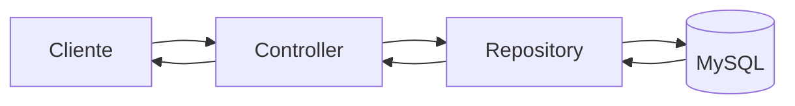

## Patrón de Proceso Orquestado

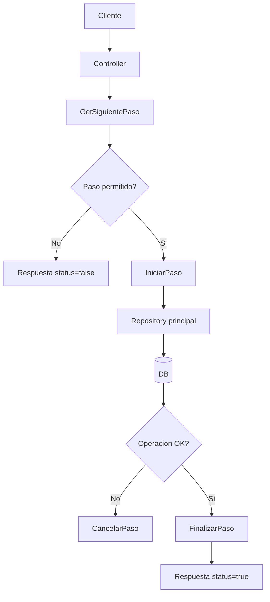

## Controller: AdministracionBancoController
Patrón: CRUD simple contra catálogo de bancos y monedas.

| Método | Endpoint | Parámetros | Validaciones / internos | Invoca | Tablas / vistas | Respuesta esperada |
| --- | --- | --- | --- | --- | --- | --- |
| `GetAllCuentaBanco` | `GET /api/AdministracionBanco` | Sin body | Sin validaciones visibles | `IAdministracionBancoRepository.GetAllBanco` | `administracionbanco`, `administracionmoneda` | `data.listaBanco` |
| `GetAllMoneda` | `GET /api/AdministracionBanco/moneda` | Sin body | Sin validaciones visibles | `IAdministracionBancoRepository.GetAllMoneda` | `administracionmoneda` | `data.listaMoneda` |
| `UpdateBanco` | `PUT /api/AdministracionBanco/update` | Body `AdministracionBanco` | Sin validaciones en controller; el repo actualiza por `LBancoId` | `IAdministracionBancoRepository.UpdateBanco` | `administracionbanco` | Confirmación sin payload |
| `InsertBanco` | `POST /api/AdministracionBanco/insert` | Body `AdministracionBanco` | Sin validaciones en controller | `IAdministracionBancoRepository.InsertBanco` | `administracionbanco` | Confirmación sin payload |
| `DeleteBanco` | `DELETE /api/AdministracionBanco/delete` | Headers `lBancoId`, `usuario?` | Sin validaciones en controller; el repo hace baja lógica (`estado = 0`) | `IAdministracionBancoRepository.DeleteBanco` | `administracionbanco` | Confirmación sin payload |

## Controller: AdministracionBuscarAsesorController
Patrón: lectura especializada vía procedimientos almacenados.

| Método | Endpoint | Parámetros | Validaciones / internos | Invoca | Tablas / vistas | Respuesta esperada |
| --- | --- | --- | --- | --- | --- | --- |
| `GetAsesoreSieteNiveles` | `GET /api/AdministracionBuscarAsesor` | Header `lContactoId` | Sin validaciones visibles | `IAdministracionBuscarAsesorRepository.GetAsesoreSieteNiveles` | `sp_GetPadresHasta7Fijos`, `sp_GetPadresHasta7Activos` | Listas de asesores fijos y activos hasta 7 niveles |

Nota: el detalle de tablas depende de los procedimientos almacenados; no se expande en el código revisado.

## Controller: AdministracionCicloController
Patrón: mantenimiento del catálogo de ciclos.

| Método | Endpoint | Parámetros | Validaciones / internos | Invoca | Tablas / vistas | Respuesta esperada |
| --- | --- | --- | --- | --- | --- | --- |
| `Get` | `GET /api/AdministracionCiclo` | Sin body | Sin validaciones visibles | `IAdministracionCicloRepository.GetCiclos` | `administracionciclo` | `data = resp.Ciclos` |
| `GetPagination` | `GET /api/AdministracionCiclo/paginacion` | Headers `page`, `pageSize`, `search?` | Sin validaciones visibles | `IAdministracionCicloRepository.GetCiclosPagination` | `administracionciclo` | `data.ciclos`, `data.total` |
| `Insert` | `POST /api/AdministracionCiclo/insert` | Body `AdministracionCicloABM` | Sin validaciones en controller; el repo calcula el siguiente `lciclo_id` | `IAdministracionCicloRepository.GuardarCiclo` | `administracionciclo` | Confirmación de creación |
| `Update` | `PUT /api/AdministracionCiclo/update` | Body `AdministracionCicloABM` | Sin validaciones en controller | `IAdministracionCicloRepository.ModificarCiclo` | `administracionciclo` | Confirmación de actualización |
| `Delete` | `DELETE /api/AdministracionCiclo/delete` | Header `LCicloId` | Sin validaciones en controller; el repo hace borrado físico | `IAdministracionCicloRepository.EliminarCiclo` | `administracionciclo` | Confirmación de borrado |

## Controller: AdministracionCicloFacturaController
Patrón: asignación de presentaciones/facturas por ciclo y semana.

| Método | Endpoint | Parámetros | Validaciones / internos | Invoca | Tablas / vistas | Respuesta esperada |
| --- | --- | --- | --- | --- | --- | --- |
| `GetAllAdministracionCiclofactura` | `GET /api/AdministracionCicloFactura` | Headers `page`, `pageSize`, `lCicloId` | Sin validaciones en controller | `IAdministracionCicloFacturaRepository.GetAllAdministracionCiclofactura` | `administracionciclopresentafactura`, `administracionciclo`, `administracionsemanaciclo`, `administracionsemana`, `administracioncontacto` | Lista paginada y total |
| `InsertAdministracionCiclofactura` | `POST /api/AdministracionCicloFactura/register` | Body `AdministracionCicloFactura` | El repo evita duplicados para la combinación revisada y genera correlativo | `IAdministracionCicloFacturaRepository.InsertAdministracionCiclofactura` | `administracionciclopresentafactura` | Confirmación sin payload |
| `DeleteAdministracionCiclofactura` | `DELETE /api/AdministracionCicloFactura/delete` | Headers `lciclofactura`, `usuario?` | El repo valida que el id sea mayor a 0 y hace baja lógica | `IAdministracionCicloFacturaRepository.DeleteAdministracionCiclofactura` | `administracionciclopresentafactura` | Confirmación sin payload |

## Controller: AdministracionComplejoController
Patrón: CRUD de complejos.

| Método | Endpoint | Parámetros | Validaciones / internos | Invoca | Tablas / vistas | Respuesta esperada |
| --- | --- | --- | --- | --- | --- | --- |
| `GetComplejo` | `GET /api/AdministracionComplejo` | Sin body | Sin validaciones visibles | `IAdministracionComplejoRepository.GetComplejo` | `administracioncomplejo`, `administracionempresa` | Lista de complejos |
| `GetComplejoPagination` | `GET /api/AdministracionComplejo/paginacion` | Headers `page`, `pageSize`, `search?` | Sin validaciones visibles | `IAdministracionComplejoRepository.GetComplejoPagination` | `administracioncomplejo`, `administracionempresa` | Lista paginada y total |
| `GuardarComplejo` | `POST /api/AdministracionComplejo/insert` | Body `AdministracionComplejoABM` | Sin validaciones en controller; el repo genera `lcomplejo_id` | `IAdministracionComplejoRepository.GuardarComplejo` | `administracioncomplejo` | Confirmación |
| `ModificarComplejo` | `PUT /api/AdministracionComplejo/update` | Body `AdministracionComplejoABM` | Sin validaciones en controller | `IAdministracionComplejoRepository.ModificarComplejo` | `administracioncomplejo` | Confirmación |
| `EliminarComplejo` | `DELETE /api/AdministracionComplejo/delete` | Header `lComplejoId` | Sin validaciones en controller; el repo hace borrado físico | `IAdministracionComplejoRepository.EliminarComplejo` | `administracioncomplejo` | Confirmación |

## Controller: AdministracionContactoController
Patrón: administración de asesores/contactos.

| Método | Endpoint | Parámetros | Validaciones / internos | Invoca | Tablas / vistas | Respuesta esperada |
| --- | --- | --- | --- | --- | --- | --- |
| `GetAll` | `GET /api/AdministracionContacto` | Query `page`, `pageSize`, `search?` | Sin validaciones visibles | `IAdministracionContactoRepository.GetAllAdministracionContacto` | `administracioncontacto`, `administracionnivel`, `basepais`, `administracionbanco`, `administracionmoneda` | `data.listaContacto`, `data.total` |
| `InsertContacto` | `POST /api/AdministracionContacto/insert` | Body `AdministracionContacto` | El repo inserta contacto y genera identificadores/código | `IAdministracionContactoRepository.InsertContacto` | `administracioncontacto` | Confirmación |
| `UpdateContacto` | `PUT /api/AdministracionContacto/update` | Body `AdministracionContacto` | Sin validaciones en controller | `IAdministracionContactoRepository.UpdateContacto` | `administracioncontacto` | Confirmación |
| `BajaContacto` | `DELETE /api/AdministracionContacto/baja` | Body `AdministracionContactoBaja` | El repo hace baja lógica | `IAdministracionContactoRepository.BajaContacto` | `administracioncontacto` | Confirmación |
| `VerificarEstadoContacto` | `GET /api/AdministracionContacto/verificar/estado` | Headers `Usuario`, `Documento` | Sin validaciones en controller; el repo calcula estado por documento | `IAdministracionContactoRepository.VerificarEstadoContacto` | `administracioncontrato`, `administracioncontacto` | `data.Estado` booleano |

## Controller: AdministracionContratoController
Patrón: consulta y mantenimiento de contratos.

| Método | Endpoint | Parámetros | Validaciones / internos | Invoca | Tablas / vistas | Respuesta esperada |
| --- | --- | --- | --- | --- | --- | --- |
| `GetAll` | `GET /api/AdministracionContrato` | Headers `page`, `pageSize`, `search?` | Sin validaciones visibles | `IAdministracionContratoRepository.GetAllAdministracionContrato` | `administracioncontrato`, `administracioncontacto`, `administracioncomplejo`, `administraciontipocontrato`, `administracionestadocontrato` | Lista paginada y total |
| `InsertContrato` | `POST /api/AdministracionContrato/insert` | Body `AdministracionContrato` | Sin validaciones en controller; el repo genera correlativo | `IAdministracionContratoRepository.InsertContrato` | `administracioncontrato` | Confirmación |
| `UpdateContrato` | `PUT /api/AdministracionContrato/update` | Body `AdministracionContrato` | Sin validaciones en controller | `IAdministracionContratoRepository.UpdateContrato` | `administracioncontrato` | Confirmación |

Nota: este repositorio también se usa como fuente auxiliar en comisiones para contratos por rango de fechas y residual.

## Controller: AdministracionCuentaBancoController
Patrón: consulta y actualización de datos bancarios del contacto.

| Método | Endpoint | Parámetros | Validaciones / internos | Invoca | Tablas / vistas | Respuesta esperada |
| --- | --- | --- | --- | --- | --- | --- |
| `GetCuentaBanco` | `GET /api/AdministracionCuentaBanco/id` | Header `lContactoId` | Sin validaciones visibles | `IAdministracionCuentaBancoRepository.GetCuentaBanco` | `administracioncontacto` | `data.dataCuentaBanco` |
| `GetAllCuentaBanco` | `GET /api/AdministracionCuentaBanco` | Headers `page`, `pageSize`, `search?` | Sin validaciones visibles | `IAdministracionCuentaBancoRepository.GetAllCuentaBanco` | `administracioncontacto`, `administracionbanco`, `administracionmoneda` | `data.listaCuentaBanco`, `data.totalRegistro` |
| `UpdateCuentaBanco` | `PUT /api/AdministracionCuentaBanco/update` | Body `DataCuentaBanco` | Sin validaciones en controller | `IAdministracionCuentaBancoRepository.UpdateCuentaBanco` | `administracioncontacto` | Confirmación |

## Controller: AdministracionDescuentoCicloTipoController
Patrón: catálogo de tipos de descuento por ciclo.

| Método | Endpoint | Parámetros | Validaciones / internos | Invoca | Tablas / vistas | Respuesta esperada |
| --- | --- | --- | --- | --- | --- | --- |
| `GetPaginacion` | `GET /api/AdministracionDescuentoCicloTipo/paginacion` | Headers `page`, `pageSize`, `search?` | Sin validaciones visibles | `IAdministracionDescuentoCicloTipoRepository.GetDescuentoCicloTipoPagination` | `administraciondescuentociclotipo` | Lista paginada y total |
| `Insert` | `POST /api/AdministracionDescuentoCicloTipo/insert` | Body `AdministracionDescuentoCicloTipo` | El repo genera correlativo | `IAdministracionDescuentoCicloTipoRepository.GuardarDescuentoCicloTipo` | `administraciondescuentociclotipo` | Confirmación |
| `Update` | `PUT /api/AdministracionDescuentoCicloTipo/update` | Body `AdministracionDescuentoCicloTipo` | Sin validaciones en controller | `IAdministracionDescuentoCicloTipoRepository.ModificarDescuentoCicloTipo` | `administraciondescuentociclotipo` | Confirmación |
| `Delete` | `DELETE /api/AdministracionDescuentoCicloTipo/delete` | Header `lDescuentoCicloTipoId` | Sin validaciones en controller; el repo hace borrado físico | `IAdministracionDescuentoCicloTipoRepository.EliminarDescuentoCicloTipo` | `administraciondescuentociclotipo` | Confirmación |

## Controller: AdministracionDescuentoComisionController
Patrón: lectura y mantenimiento de descuentos aplicados al ciclo.

| Método | Endpoint | Parámetros | Validaciones / internos | Invoca | Tablas / vistas | Respuesta esperada |
| --- | --- | --- | --- | --- | --- | --- |
| `GetAllAdministracionCObservacionComision` | `GET /api/AdministracionDescuentoComision` | Headers `lContactoId`, `lCicloId`, `lSemanaId` | Sin validaciones en controller | `GetComision`, `GetDetalleDescuentoCiclo` | `administracionbonoresidual`, `administracionventagrupo`, `administracionventapersonal`, `bonopar`, `tbl_retencionempresa`, `administraciondescuentociclo`, `administraciondescuentociclodetalle`, `administracioncomplejo`, `administraciondescuentociclotipo`, `administracioncontrato`, `administracioncontacto` | Resumen de comisión + detalle de descuentos |
| `EliminarDescuento` | `DELETE /api/AdministracionDescuentoComision/delete` | Headers `lDescuentoDetalleId`, `lContactoId`, `lCicloId`, `usuario?` | Sin validaciones en controller; el repo borra detalle y recompone totales del encabezado | `IAdministracionDescuentoComisionRepository.EliminarDescuento` | `administraciondescuentociclodetalle`, `administraciondescuentociclo` | Confirmación |
| `InsertarDescuento` | `POST /api/AdministracionDescuentoComision/insert` | Body `DataDescuento` | El repo crea encabezado si no existe y agrega detalle | `IAdministracionDescuentoComisionRepository.InsertarDescuento` | `administraciondescuentociclo`, `administraciondescuentociclodetalle` | Confirmación |

## Controller: AdministracionDetalleFacturaController
Patrón: catálogo de detalles/tipos de facturación por comisión.

| Método | Endpoint | Parámetros | Validaciones / internos | Invoca | Tablas / vistas | Respuesta esperada |
| --- | --- | --- | --- | --- | --- | --- |
| `GetPaginacion` | `GET /api/AdministracionDetalleFactura/paginacion` | Headers `page`, `pageSize` | Sin validaciones visibles | `IAdministracionDetalleFacturaRepository.GetDetalleFacturaPagination` | `administraciondetallefactura`, `administraciontipocomision` | `data` paginado y `total` |
| `Insert` | `POST /api/AdministracionDetalleFactura/insert` | Body `AdministracionDetalleFactura` | El repo evita duplicar `ltipocomision_id` activo | `IAdministracionDetalleFacturaRepository.GuardarDetalleFactura` | `administraciondetallefactura` | Confirmación |
| `Update` | `PUT /api/AdministracionDetalleFactura/update` | Body `AdministracionDetalleFactura` | Sin validaciones en controller | `IAdministracionDetalleFacturaRepository.ModificarDetalleFactura` | `administraciondetallefactura` | Confirmación |
| `Delete` | `DELETE /api/AdministracionDetalleFactura/delete` | Header `lDetalleFacturaId` | Sin validaciones en controller; el repo hace baja lógica | `IAdministracionDetalleFacturaRepository.EliminarDetalleFactura` | `administraciondetallefactura` | Confirmación |
| `GetTipoComision` | `GET /api/AdministracionDetalleFactura/tipo/comision` | Sin body | Sin validaciones visibles | `IAdministracionDetalleFacturaRepository.GetTipoComision` | `administraciontipocomision` | `data.tipoComision` |

## Controller: AdministracionEmpresaController
Patrón: CRUD de empresas.

| Método | Endpoint | Parámetros | Validaciones / internos | Invoca | Tablas / vistas | Respuesta esperada |
| --- | --- | --- | --- | --- | --- | --- |
| `GetSemana` | `GET /api/AdministracionEmpresa` | Sin body | Sin validaciones visibles | `IAdministracionEmpresaRepository.GetEmpresas` | `administracionempresa` | Lista de empresas |
| `GetPaginacion` | `GET /api/AdministracionEmpresa/paginacion` | Headers `page`, `pageSize`, `search?` | Sin validaciones visibles | `IAdministracionEmpresaRepository.GetEmpresasPagination` | `administracionempresa` | Lista paginada y total |
| `Insert` | `POST /api/AdministracionEmpresa/insert` | Body `AdministracionEmpresa` | El repo genera correlativo | `IAdministracionEmpresaRepository.GuardarEmpresa` | `administracionempresa` | Confirmación |
| `Update` | `PUT /api/AdministracionEmpresa/update` | Body `AdministracionEmpresa` | Sin validaciones en controller | `IAdministracionEmpresaRepository.ModificarEmpresa` | `administracionempresa` | Confirmación |
| `Delete` | `DELETE /api/AdministracionEmpresa/delete` | Header `lEmpresaId` | Sin validaciones en controller; el repo hace borrado físico | `IAdministracionEmpresaRepository.EliminarEmpresa` | `administracionempresa` | Confirmación |

## Controller: AdministracionNivelController
Patrón: CRUD de niveles.

| Método | Endpoint | Parámetros | Validaciones / internos | Invoca | Tablas / vistas | Respuesta esperada |
| --- | --- | --- | --- | --- | --- | --- |
| `GetNivel` | `GET /api/AdministracionNivel` | Sin body | Sin validaciones visibles | `IAdministracionNivelRepository.GetNivel` | `administracionnivel` | `data = responseNivel.Nivel` |
| `GetNivelPaginacion` | `GET /api/AdministracionNivel/paginacion` | Headers `page`, `pageSize`, `search?` | Sin validaciones visibles | `IAdministracionNivelRepository.GetNivelPagination` | `administracionnivel` | Lista paginada y total |
| `GuardarNivel` | `POST /api/AdministracionNivel/insert` | Body `AdministracionNivel` | Sin validaciones en controller | `IAdministracionNivelRepository.GuardarNivel` | `administracionnivel` | Confirmación |
| `ModificarNivel` | `PUT /api/AdministracionNivel/update` | Body `AdministracionNivel` | Sin validaciones en controller | `IAdministracionNivelRepository.ModificarNivel` | `administracionnivel` | Confirmación |
| `ModificarNivel` | `DELETE /api/AdministracionNivel/delete` | Header `lNivelId` | Sin validaciones en controller; el repo hace borrado físico | `IAdministracionNivelRepository.EliminarNivel` | `administracionnivel` | Confirmación |

Nota: el método DELETE conserva el nombre `ModificarNivel` en el controller; es un detalle de nomenclatura, no de lógica.

## Controller: AdministracionObservacionComisionController
Patrón: CRUD de observaciones de comisión.

| Método | Endpoint | Parámetros | Validaciones / internos | Invoca | Tablas / vistas | Respuesta esperada |
| --- | --- | --- | --- | --- | --- | --- |
| `GetAllAdministracionCObservacionComision` | `GET /api/AdministracionObservacionComision` | Headers `page`, `pageSize`, `search?`, `lCicloId` | Sin validaciones visibles | `IAdministracionObservacionComisionRepository.GetAllAdministracionCObservacionComisionAsync` | `administracionobservacioncomision` | Lista paginada y total |
| `InsertAdministracionObservacionComision` | `POST /api/AdministracionObservacionComision/register` | Body `AdministracionObservacionComision` | Sin validaciones en controller | `IAdministracionObservacionComisionRepository.InsertAdministracionObservacionComision` | `administracionobservacioncomision` | Confirmación |
| `UpdateAdministracionObservacionComision` | `PUT /api/AdministracionObservacionComision/update` | Body `AdministracionObservacionComision` | Sin validaciones en controller | `IAdministracionObservacionComisionRepository.UpdateAdministracionObservacionComision` | `administracionobservacioncomision` | Confirmación |
| `DeleteAdministracionObservacionComision` | `DELETE /api/AdministracionObservacionComision/delete` | Headers `lObservacionId`, `usuario?` | El repo exige id válido y hace borrado físico | `IAdministracionObservacionComisionRepository.DeleteAdministracionObservacionComision` | `administracionobservacioncomision` | Confirmación |

## Controller: AdministracionSemanaCicloController
Patrón: administración de semanas por ciclo.

| Método | Endpoint | Parámetros | Validaciones / internos | Invoca | Tablas / vistas | Respuesta esperada |
| --- | --- | --- | --- | --- | --- | --- |
| `GetPaginacion` | `GET /api/AdministracionSemanaCiclo/paginacion` | Headers `page`, `pageSize`, `search?` | Sin validaciones visibles | `IAdministracionSemanaCicloRepository.GetSemanaCicloPagination` | `administracionsemanaciclo`, `administracionsemana`, `administracionciclo` | Lista paginada y total |
| `Insert` | `POST /api/AdministracionSemanaCiclo/insert` | Body `AdministracionSemanaCicloABM` | El repo inserta registro con validación de estructura y correlativo | `IAdministracionSemanaCicloRepository.GuardarSemanaCiclo` | `administracionsemanaciclo` | Confirmación |
| `Update` | `PUT /api/AdministracionSemanaCiclo/update` | Body `AdministracionSemanaCicloABM` | Sin validaciones en controller | `IAdministracionSemanaCicloRepository.ModificarSemanaCiclo` | `administracionsemanaciclo` | Confirmación |
| `Delete` | `DELETE /api/AdministracionSemanaCiclo/delete` | Header `lSemanaId` | Sin validaciones en controller; el repo hace borrado físico | `IAdministracionSemanaCicloRepository.EliminarSemanaCiclo` | `administracionsemanaciclo` | Confirmación |

## Controller: AdministracionSemanaController
Patrón: CRUD de semanas.

| Método | Endpoint | Parámetros | Validaciones / internos | Invoca | Tablas / vistas | Respuesta esperada |
| --- | --- | --- | --- | --- | --- | --- |
| `GetSemana` | `GET /api/AdministracionSemana` | Sin body | Sin validaciones visibles | `IAdministracionSemanaRepository.GetSemana` | `administracionsemana` | `data = resp.Semana` |
| `GetSemanaPaginacion` | `GET /api/AdministracionSemana/paginacion` | Headers `page`, `pageSize`, `search?` | Sin validaciones visibles | `IAdministracionSemanaRepository.GetSemanaPagination` | `administracionsemana` | Lista paginada y total |
| `GuardarSemana` | `POST /api/AdministracionSemana/insert` | Body `AdministracionSemana` | Sin validaciones en controller | `IAdministracionSemanaRepository.GuardarSemana` | `administracionsemana` | Confirmación |
| `ModificarSemana` | `PUT /api/AdministracionSemana/update` | Body `AdministracionSemana` | Sin validaciones en controller | `IAdministracionSemanaRepository.ModificarSemana` | `administracionsemana` | Confirmación |
| `EliminarSemana` | `DELETE /api/AdministracionSemana/delete` | Header `lSemanaId` | Sin validaciones en controller; el repo hace borrado físico | `IAdministracionSemanaRepository.EliminarSemana` | `administracionsemana` | Confirmación |

## Controller: AdministracionTipoContactoController
Patrón: CRUD de tipos de contacto y porcentajes grupales.

| Método | Endpoint | Parámetros | Validaciones / internos | Invoca | Tablas / vistas | Respuesta esperada |
| --- | --- | --- | --- | --- | --- | --- |
| `GetTipoContacto` | `GET /api/AdministracionTipoContacto` | Sin body | Sin validaciones visibles | `IAdministracionTipoContactoRepository.GetTipoContacto` | `administraciontipocontacto` | `data = resp.TipoContacto` |
| `GetTipoContactoPagination` | `GET /api/AdministracionTipoContacto/paginacion` | Headers `page`, `pageSize`, `search?` | Sin validaciones visibles | `IAdministracionTipoContactoRepository.GetTipoContactoPagination` | `administraciontipocontacto` | Lista paginada y total |
| `Guardar` | `POST /api/AdministracionTipoContacto/insert` | Body `AdministracionTipoContacto` | Sin validaciones en controller | `IAdministracionTipoContactoRepository.GuardarTipoContacto` | `administraciontipocontacto` | Confirmación |
| `Modificar` | `PUT /api/AdministracionTipoContacto/update` | Body `AdministracionTipoContacto` | Sin validaciones en controller | `IAdministracionTipoContactoRepository.ModificarTipoContacto` | `administraciontipocontacto` | Confirmación |
| `Eliminar` | `DELETE /api/AdministracionTipoContacto/delete` | Header `lTipoContactoId` | Sin validaciones en controller; el repo hace borrado físico | `IAdministracionTipoContactoRepository.EliminarTipoContacto` | `administraciontipocontacto` | Confirmación |

## Controller: AdministracionTipoContratoController
Patrón: CRUD de tipos de contrato.

| Método | Endpoint | Parámetros | Validaciones / internos | Invoca | Tablas / vistas | Respuesta esperada |
| --- | --- | --- | --- | --- | --- | --- |
| `GetTipoContrato` | `GET /api/AdministracionTipoContrato` | Sin body | Sin validaciones visibles | `IAdministracionTipoContratoRepository.GetTipoContrato` | `administraciontipocontrato` | `data = resp.TipoContrato` |
| `GetPaginacion` | `GET /api/AdministracionTipoContrato/paginacion` | Headers `page`, `pageSize`, `search?` | Sin validaciones visibles | `IAdministracionTipoContratoRepository.GetTipoContratoPagination` | `administraciontipocontrato` | Lista paginada y total |
| `Insert` | `POST /api/AdministracionTipoContrato/insert` | Body `AdministracionTipoContratoABM` | Sin validaciones en controller | `IAdministracionTipoContratoRepository.GuardarTipoContrato` | `administraciontipocontrato` | Confirmación |
| `Update` | `PUT /api/AdministracionTipoContrato/update` | Body `AdministracionTipoContratoABM` | Sin validaciones en controller | `IAdministracionTipoContratoRepository.ModificarTipoContrato` | `administraciontipocontrato` | Confirmación |
| `Delete` | `DELETE /api/AdministracionTipoContrato/delete` | Header `lTipoContratoId` | Sin validaciones en controller; el repo hace borrado físico | `IAdministracionTipoContratoRepository.EliminarTipoContrato` | `administraciontipocontrato` | Confirmación |

## Controller: BrConfiguracionController
Patrón: configuración de porcentajes para bono residual por ciclo, nivel y tipo de producto.

| Método | Endpoint | Parámetros | Validaciones / internos | Invoca | Tablas / vistas | Respuesta esperada |
| --- | --- | --- | --- | --- | --- | --- |
| `GetDatos` | `GET /api/BrConfiguracion/get/datos` | Header `Usuario` | Sin validaciones visibles | `GetNivel`, `GetTipoProducto` | `br_niveles`, `br_tipoproducto` | Catálogos `Nivel` y `TipoProducto` |
| `Get` | `GET /api/BrConfiguracion/get/configuracion` | Sin body | El controller agrupa detalle por configuración | `IBrConfiguracionRepository.GetConfiguracion` | `br_configuracion`, `br_configuraciondetalle`, `br_niveles`, `br_tipoproducto`, `administracionciclo` | `data.lista` resumida por encabezado |
| `Save` | `POST /api/BrConfiguracion/save/configuracion` | Body `BrConfiguracion` | Si es alta valida unicidad por `LCicloId + TipoProductoId`; luego inserta/actualiza encabezado y reinserta detalles | `ValidarRegistro`, `GuardarConfiguracion` | `br_configuracion`, `br_configuraciondetalle` | Confirmación |
| `Delete` | `DELETE /api/BrConfiguracion/delete/configuracion` | Headers `Usuario`, `brConfiguracionId` | Sin validaciones en controller; el repo hace baja lógica en encabezado y detalle | `IBrConfiguracionRepository.EliminarConfiguracion` | `br_configuracion`, `br_configuraciondetalle` | Confirmación |

## Controller: ConfiguracionProcesoComisionesController
Patrón: parametrización de comisión de venta personal por ciclo, complejo y rangos de inicial.

| Método | Endpoint | Parámetros | Validaciones / internos | Invoca | Tablas / vistas | Respuesta esperada |
| --- | --- | --- | --- | --- | --- | --- |
| `GuardarConfiguracionVentaPersona` | `POST /api/ConfiguracionProcesoComisiones/vta/cnx` | Body `PC_ConfigVtaPersonal` | Primero arma `complejosId`; valida que esos complejos no existan ya para el ciclo; luego guarda encabezado, complejos e iniciales | `VerificarComplejos`, `GuardarConfiguracionComisionVentaPersonal` | `pc_configvtapersonal`, `pc_configvtapersonalcomplejo`, `pc_configvtapersonalinicial`, `administracioncomplejo` | Confirmación; si hay colisión devuelve `swall=true` y la lista en conflicto |
| `GetConfiguracionVentaPersona` | `GET /api/ConfiguracionProcesoComisiones/get/vta/cnx` | Sin body | Sin validaciones visibles | `IConfiguracionProcesoComisionesRepository.GETConfiguracionComisionVentaPersonal` | `pc_configvtapersonal`, `pc_configvtapersonalcomplejo`, `pc_configvtapersonalinicial`, `administracionciclo`, `administracioncomplejo` | Lista completa de configuraciones |
| `DeleteConfiguracionVentaPersona` | `DELETE /api/ConfiguracionProcesoComisiones/delete/vta/cnx` | Headers `usuario`, `ConfigVtaPersonalId` | Sin validaciones en controller; el repo hace baja lógica del encabezado | `IConfiguracionProcesoComisionesRepository.DeleteConfiguracionComisionVentaPersonal` | `pc_configvtapersonal` | Confirmación |

## Controller: UtilsController
Patrón: catálogos auxiliares para combos y filtros.

| Método | Endpoint | Parámetros | Validaciones / internos | Invoca | Tablas / vistas | Respuesta esperada |
| --- | --- | --- | --- | --- | --- | --- |
| `GetAdministracionSemanaCiclo` | `GET /api/Utils/administracion/semana/ciclo` | Header `lCicloId` | Sin validaciones visibles | `IUtilsRepository.GetSemanaCiclosAsync` | `administracionsemanaciclo`, `administracionsemana`, `administracionciclo` | Lista de semanas del ciclo |
| `GetDepartamento` | `GET /api/Utils/administracion/departamento` | Header `lPaisId=2` | Sin validaciones visibles | `IUtilsRepository.GetDepartamento` | `basepaisdepartamento` | Lista de departamentos |
| `GetTipoContrato` | `GET /api/Utils/administracion/tipo/contrato` | Sin body | Sin validaciones visibles | `IUtilsRepository.GetTipoContrato` | `administraciontipocontrato` | Catálogo de tipos de contrato |
| `GetEstadoContrato` | `GET /api/Utils/administracion/estado/contrato` | Sin body | Sin validaciones visibles | `IUtilsRepository.GetEstadoContrato` | `administracionestadocontrato` | Catálogo de estados |
| `GetTipoBaja` | `GET /api/Utils/administracion/tipo/baja` | Sin body | Sin validaciones visibles | `IUtilsRepository.GetTipoBaja` | `administraciontipobaja` | Catálogo de tipos de baja |
| `GetPais` | `GET /api/Utils/administracion/pais` | Sin body | Sin validaciones visibles | `IUtilsRepository.GetPais` | `basepais` | Catálogo de países |
| `GetTipoDescuento` | `GET /api/Utils/tipo/descuento` | Sin body | Sin validaciones visibles | `IUtilsRepository.GetTipoDescuento` | `administraciondescuentociclotipo` | Catálogo de tipos de descuento |

## Controller: AdministracionHabilitacionComisionController
Patrón: catálogo operativo de habilitaciones para permitir o bloquear comisiones por asesor y ciclo.

| Método | Endpoint | Parámetros | Validaciones / internos | Invoca | Tablas / vistas | Respuesta esperada |
| --- | --- | --- | --- | --- | --- | --- |
| `GetHabilitaciones` | `GET /api/AdministracionHabilitacionComision/GetHabilitaciones` | Headers `LogTransaccionId?`, `Usuario`, `LCicloId` | Usa `PasoRegistroHabilitacionesEjecutado` para marcar si el paso ya corrió | `GetHabilitaciones`, `GetSiguientePaso` | `administracionhabilitacioncomision`, `administracioncontacto`, `conf_*` | `data.habilitaciones`, `data.controlPasos` |
| `SaveHabilitaciones` | `POST /api/AdministracionHabilitacionComision/SaveHabilitaciones` | Headers `LogTransaccionId?`, `Usuario`, `LCicloId`; body `List<ItemHabilitacionComision>` | Valida paso previo, inicia/finaliza/cancela paso; el repo valida lista no nula, ciclo válido, asesor válido, monto > 0 y no duplicados | `GetSiguientePaso`, `IniciarPaso`, `SaveHabilitaciones`, `FinalizarPaso`, `CancelarPaso` | `administracionhabilitacioncomision`, `administracioncontacto`, `conf_*`; si bloquea asesores limpia tablas de comisiones relacionadas | Confirmación |
| `UpdateHabilitacion` | `PUT /api/AdministracionHabilitacionComision/UpdateHabilitacion` | Headers `LogTransaccionId?`, `Usuario`; body `ItemHabilitacionComision` | El repo exige ids válidos y `MontoVenta > 0` | `IAdministracionHabilitacionComisionRepository.UpdateHabilitacion` | `administracionhabilitacioncomision` | Confirmación |
| `DeleteHabilitacion` | `DELETE /api/AdministracionHabilitacionComision/DeleteHabilitacion` | Headers `LogTransaccionId?`, `Usuario`, `LHabilitacionId` | El repo exige id válido | `IAdministracionHabilitacionComisionRepository.DeleteHabilitacion` | `administracionhabilitacioncomision` | Confirmación |

### Método: SaveHabilitaciones

- Endpoint: `POST /api/AdministracionHabilitacionComision/SaveHabilitaciones`
- Descripción: reemplaza todas las habilitaciones del ciclo y sincroniza el paso `REGISTRO_HABILITACIONES`.
- Parámetros:
  - Headers: `LogTransaccionId?`, `Usuario`, `LCicloId`
  - Body: `List<ItemHabilitacionComision>`
- Validaciones principales:
  - No se puede ejecutar si el siguiente paso aún es uno previo a habilitaciones.
  - La lista no puede ser nula.
  - `LCicloId` debe ser válido.
  - Todos los registros deben tener `LContactoId > 0`.
  - Todos los registros deben tener `MontoVenta > 0`.
  - No se permite repetir un mismo asesor dentro del mismo ciclo.
- Servicio o repositorio que invoca:
  - `IControlProcesoRepository.GetSiguientePaso`
  - `IControlProcesoRepository.IniciarPaso`
  - `IAdministracionHabilitacionComisionRepository.SaveHabilitaciones`
  - `IControlProcesoRepository.FinalizarPaso`
  - `IControlProcesoRepository.CancelarPaso`
- Métodos internos llamados:
  - `PuedeGuardarHabilitaciones`
  - `EsPasoPrevioRegistroHabilitaciones`
- Tablas o vistas consultadas:
  - `administracionhabilitacioncomision`
  - `administracioncontacto`
  - `conf_procesos`, `conf_pasos`, `conf_proceso_instancias`, `conf_proceso_ciclos`, `conf_proceso_pasos`
  - Si hay asesores bloqueados, el repo también limpia registros del ciclo en `bonopar`, `administracionbonoresidual`, `t_bonocompleto`, `administracionredempresacomplejo`, `administracionventagrupo`, `administracionventapersonal`, `administracionbonocarrera`
- Respuesta final esperada:
  - Éxito: confirmación simple.
  - Rechazo de paso: mensaje indicando que primero deben completarse pasos previos.
  - Error de proceso: cancela el paso y devuelve `status=false`.

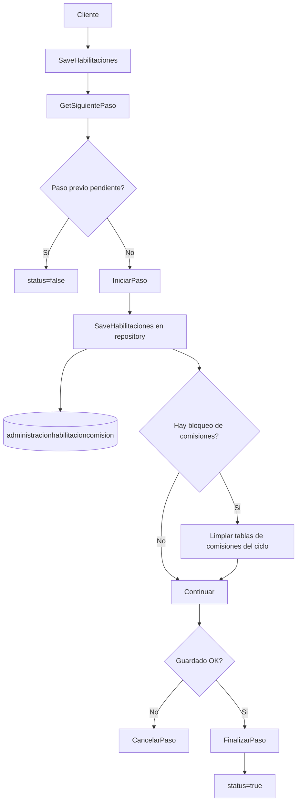

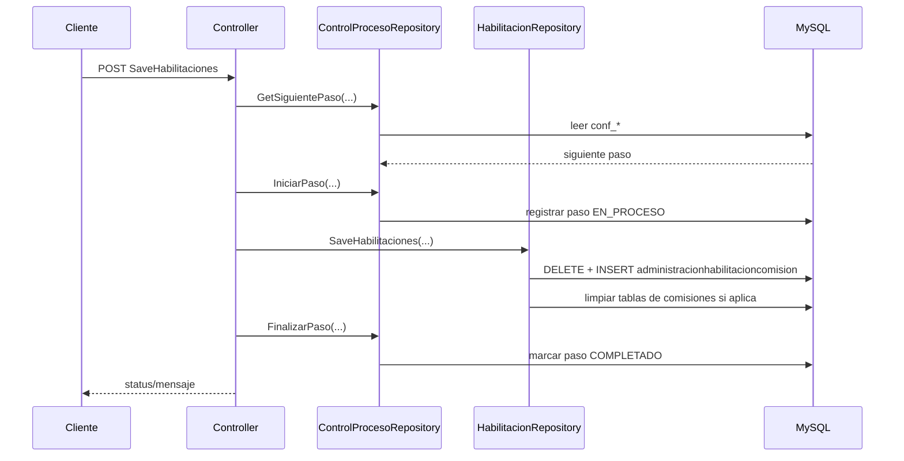

## Controller: ControlProcesoController
Patrón: administración de la definición de pasos y del estado de ejecución por ciclo.

| Método | Endpoint | Parámetros | Validaciones / internos | Invoca | Tablas / vistas | Respuesta esperada |
| --- | --- | --- | --- | --- | --- | --- |
| `GetConfiguracionProcesos` | `GET /api/ControlProceso/configuracion` | Header `Usuario` | Sin validaciones adicionales | `IControlProcesoRepository.GetConfiguracionProcesos` | `conf_procesos`, `conf_pasos`, `conf_paso_dependencias` | Configuración completa del proceso |
| `GuardarConfiguracionProceso` | `POST /api/ControlProceso/configuracion` | Header `Usuario`; body `ControlProcesoConfiguracion` | El repo valida nombre, pasos, orden, duplicados, dependencias, ciclos y bloqueo de renombrar `COMISIONES` | `IControlProcesoRepository.GuardarConfiguracionProceso` | `conf_procesos`, `conf_pasos`, `conf_paso_dependencias` | Proceso guardado con su estructura |
| `DeleteConfiguracionProceso` | `DELETE /api/ControlProceso/configuracion` | Headers `Usuario`, `ProcesoId` | No permite desactivar el proceso principal `COMISIONES` | `IControlProcesoRepository.DeleteConfiguracionProceso` | `conf_procesos`, `conf_pasos` | Confirmación |
| `GetControlProcesoCiclo` | `GET /api/ControlProceso/ciclo` | Headers `lCicloId`, `Usuario` | Sin validaciones extra | `IControlProcesoRepository.GetResumenProcesoCiclo` | `conf_proceso_ciclos`, `conf_proceso_instancias`, `conf_proceso_pasos`, `conf_pasos`, `conf_procesos` | Resumen/historial del ciclo |
| `ResetControlProcesoCiclo` | `POST /api/ControlProceso/reset/ciclo` | Headers `lCicloId`, `Usuario`, `Inicio`, `Fin` | Reinicia estructuras de proceso y borra datos de cálculo del ciclo | `IControlProcesoRepository.ReiniciarCiclo` | `conf_*`, `ControlProceso`, `VentaRezagadasCiclo`, `administracionventapersonal`, `administracionventagrupo`, `administracionbonoresidual`, `bonopar`, `red_comprimida`, `red_completa_cuotas`, `t_productos_*`, `upgrade_solicitud`, `T_ACCIONESCUOTASGRL`, `sp_reiniciar_ciclo` | Resultado detallado de reinicio |
| `CerrarControlProcesoCiclo` | `POST /api/ControlProceso/cerrar/ciclo` | Headers `lCicloId`, `Usuario` | Ejecuta cierre por procedimiento | `IControlProcesoRepository.CerrarCiclo` | `sp_cerrar_ciclo` | Resultado del cierre |

### Método: GuardarConfiguracionProceso

- Endpoint: `POST /api/ControlProceso/configuracion`
- Descripción: crea o actualiza la definición del proceso y sus pasos/dependencias.
- Parámetros:
  - Header: `Usuario`
  - Body: `ControlProcesoConfiguracion`
- Validaciones principales:
  - El nombre del proceso es obligatorio.
  - Debe existir al menos un paso.
  - No se permiten nombres de paso duplicados.
  - No se permiten órdenes repetidos.
  - Un paso no puede depender de sí mismo.
  - Toda dependencia debe existir y apuntar a un paso anterior.
  - No se permiten dependencias circulares.
  - No se puede renombrar el proceso principal `COMISIONES`.
- Servicio o repositorio que invoca:
  - `IControlProcesoRepository.GuardarConfiguracionProceso`
- Métodos internos llamados:
  - Validaciones internas del repo sobre dependencias y circularidad.
- Tablas o vistas consultadas:
  - `conf_procesos`
  - `conf_pasos`
  - `conf_paso_dependencias`
- Respuesta final esperada:
  - Éxito: devuelve el proceso persistido con sus pasos.
  - Error de validación: `status=false` y mensaje específico.

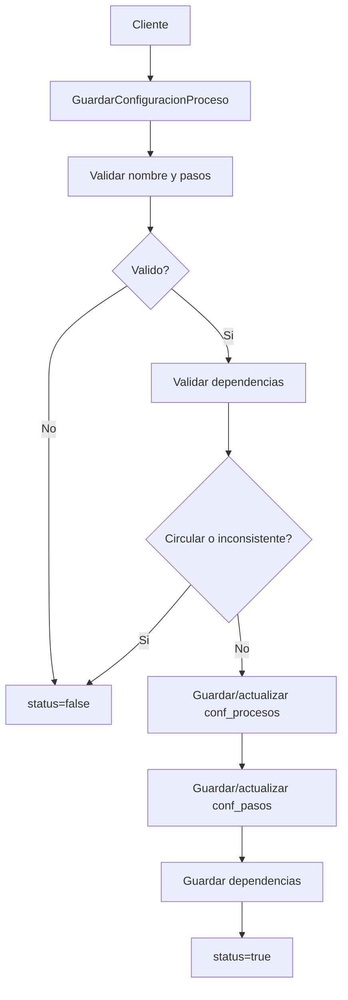

### Método: ResetControlProcesoCiclo

- Endpoint: `POST /api/ControlProceso/reset/ciclo`
- Descripción: reinicia el proceso `COMISIONES` para el ciclo y limpia artefactos de cálculo.
- Parámetros:
  - Headers: `lCicloId`, `Usuario`, `Inicio`, `Fin`
- Validaciones principales:
  - Dependen del resultado de `sp_reiniciar_ciclo` y de la limpieza de tablas del ciclo.
- Servicio o repositorio que invoca:
  - `IControlProcesoRepository.ReiniciarCiclo`
- Métodos internos llamados:
  - Limpieza de tablas y ejecución de `sp_reiniciar_ciclo`
- Tablas o vistas consultadas:
  - `conf_proceso_pasos`, `ControlProceso`, `VentaRezagadasCiclo`, `administracionventapersonal`, `administracionventagrupo`, `administracionbonoresidual`, `bonopar`, `bonopardetalle`, `red_comprimida`, `red_completa_cuotas`, `administracionhabilitacioncomision`, `t_bonocompleto`, `t_productos_pagar_mensuales`, `t_productos_detalle_cuotas`, `t_cuotas_ventas_productos_pagar_mensual`, `upgrade_solicitud`, `T_ACCIONESCUOTASGRL`
- Respuesta final esperada:
  - Estado del reinicio y mensaje devuelto por el procedimiento/repositorio.

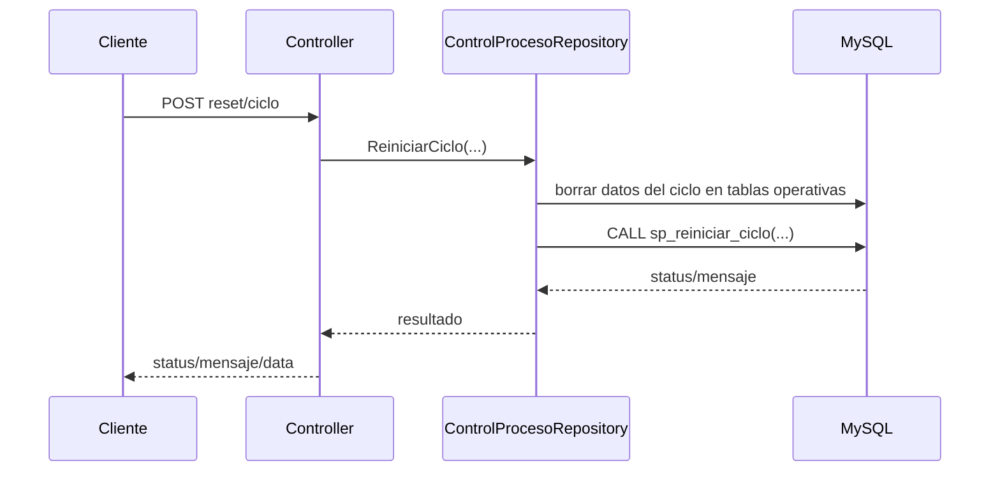

## Controller: CasosEspecialesController
Patrón: lectura de ventas especiales CNX y contraste con ventas GRD del periodo.

| Método | Endpoint | Parámetros | Validaciones / internos | Invoca | Tablas / vistas | Respuesta esperada |
| --- | --- | --- | --- | --- | --- | --- |
| `Get` | `GET /api/CasosEspeciales/casos/especiales` | Headers `Usuario`, `LCicloId`, `Inicio`, `Fin` | El check de paso existe pero está comentado; usa regla del repo para conservar especiales si el vendedor tuvo venta normal o al menos 2 especiales | `GetSiguientePaso`, `ICasosEspecialesRepository.GetVentasCasosEspeciales`, `IAdministracionContratoRepository.GetContratoFecha` | SQL Server dinámico CNX por `ScriptCnx.QueryVentaCnx(..., true)`, `administracioncontrato`, `administracioncontacto`, `upgrade_solicitud` | Ventas especiales, ventas GRD y XLS |

Nota: la consulta CNX usa tablas dinámicas como `*.dbo.INVENTA`, `*.dbo.INVENTA_CCN`, `*.dbo.INVENTADETALLE`, `BDComisiones.dbo.grlCLIENTE*`; se documenta como mejor interpretación.

## Controller: ProcesoComisionesController
Patrón: orquestador principal del pipeline de comisiones directas, grupo, ventas rezagadas y ventas especiales.

| Método | Endpoint | Parámetros | Validaciones / internos | Invoca | Tablas / vistas | Respuesta esperada |
| --- | --- | --- | --- | --- | --- | --- |
| `GetVentaCnx` | `GET /api/ProcesoComisiones/vta/cnx` | Header `lCicloId` | Busca fechas del ciclo y luego consulta CNX + contratos GRD | `GetCiclos`, `GetVentaCnx`, `GetContratoFecha`, `GetSiguientePaso` | `administracionciclo`, SQL Server dinámico CNX, `administracioncontrato` | `data.VtaCnx`, `data.VtaGrd`, `data.controlPasos` |
| `Ejecutar` | `POST /api/ProcesoComisiones/ejemplo` | Sin parámetros | No ejecuta lógica real; el llamado al cron está comentado | Ninguno efectivo | Ninguna | `{ ex: true }` |
| `GetVtaRezagadas` | `GET /api/ProcesoComisiones/vta/rezagadas` | Headers `lCicloId`, `Usuario` | Sin validaciones extra | `GetVtaRezada`, `GetSiguientePaso` | `VentaRezagadasCiclo`, `conf_*` | Lista de ventas rezagadas y control de paso |
| `GetVentaPersonal` | `GET /api/ProcesoComisiones/venta/personal` | Headers `lCicloId`, `Inicio`, `Fin`, `Usuario` | Excluye asesores bloqueados; recalcula `UPGRADE`, `RECOMPRA` y `RECUPERACION`; si falla habilitación corta el flujo | `GetCalculoVentaPersonal`, `GetHabilitaciones`, `GetSiguientePaso`, `GetUpgradeSolicitudGrd` | `administracioncontrato`, `pc_configvtapersonal*`, `administracionventapersonal`, `administracioncontacto`, `administracionhabilitacioncomision`, `upgrade_solicitud` | `ventaPersonal`, `ventaPersonalCalculado`, XLS y control de paso |
| `SaveVenta` | `POST /api/ProcesoComisiones/save/vta/proceso` | Body `RequestGuardarVentaGRD` | Valida paso esperado según `Rezagada` y `EsEspecial`; inicia paso; si es especial guarda `upgrade_solicitud`; lanza proceso en background | `GetSiguientePaso`, `IniciarPaso`, `GuardarVtaRezagadas`, `GetUpgradeSolicitudPorVentasCnx`, `SaveUpgradeSolicitud`, `MiCronJob.ProcesoPrincipal` | `VentaRezagadasCiclo`, `upgrade_solicitud`, estructuras consultadas por el job | Mensaje de procesamiento en segundo plano |
| `SaveVtaPersonal` | `POST /api/ProcesoComisiones/save/vta/personal` | Body `RequestSaveVtaPersonal` | Valida paso actual, compara cantidad enviada contra DB, excluye bloqueados, recalcula especiales, guarda comisiones y recalcula residual; cancela paso si algo falla | `GetSiguientePaso`, `IniciarPaso`, `GetCalculoVentaPersonal`, `GetHabilitaciones`, `GetUpgradeSolicitudGrd`, `InsertVentaPersonal`, helper `CalculoVentaResidual`, `FinalizarPaso`, `CancelarPaso` | `administracioncontrato`, `administracionventapersonal`, `administracionhabilitacioncomision`, `upgrade_solicitud`, `t_productos_pagar_mensuales` | Confirmación o error de consistencia |
| `GetVentaGrupo` | `GET /api/ProcesoComisiones/venta/grupo` | Headers `lCicloId`, `Inicio`, `Fin`, `Usuario` | Excluye bloqueados y marca ganadores habilitados | `GetCalculoVentaGrupo`, `GetHabilitaciones`, `GetSiguientePaso` | `red_comprimida`, `administracioncontrato`, `administracioncontacto`, `administraciontipocontacto`, `administracionhabilitacioncomision` | Lista, personas habilitadas, XLS y control de paso |
| `SaveVtaGrupo` | `POST /api/ProcesoComisiones/save/vta/grupo` | Body `RequestGuardarVentaGrupo` | Valida paso actual, compara cantidad enviada contra DB, excluye bloqueados, obtiene semana del ciclo, guarda comisiones de grupo y finaliza/cancela paso | `GetSiguientePaso`, `IniciarPaso`, `GetCalculoVentaGrupo`, `GetHabilitaciones`, `GetSemanaCicloId`, `InsertAdministracionVentaGrupo`, `FinalizarPaso`, `CancelarPaso` | `red_comprimida`, `administracionventagrupo`, `administracionsemanaciclo`, `administracionhabilitacioncomision` | Confirmación |

### Método: SaveVenta

- Endpoint: `POST /api/ProcesoComisiones/save/vta/proceso`
- Descripción: dispara el registro base de ventas del ciclo, sea normal, rezagada o especial.
- Parámetros:
  - Body `RequestGuardarVentaGRD`
- Validaciones principales:
  - Determina el paso esperado:
    - `ADICIONAR_VENTAS` si `Rezagada = true`
    - `VENTAS_ESPECIALES` si `EsEspecial = true`
    - `OBTENER_VENTAS` en caso contrario
  - Si el siguiente paso no coincide, rechaza reproceso.
  - Si el inicio del paso falla, devuelve el mensaje de control de proceso.
- Servicio o repositorio que invoca:
  - `IControlProcesoRepository.GetSiguientePaso`
  - `IControlProcesoRepository.IniciarPaso`
  - `IProcesoComisionesRepository.GuardarVtaRezagadas`
  - `ICasosEspecialesRepository.GetUpgradeSolicitudPorVentasCnx`
  - `ICasosEspecialesRepository.SaveUpgradeSolicitud`
  - `MiCronJob.ProcesoPrincipal` vía `Task.Run`
- Métodos internos llamados:
  - Ninguno dentro del controller; el proceso fuerte se delega al job.
- Tablas o vistas consultadas:
  - `VentaRezagadasCiclo`
  - `upgrade_solicitud`
  - `conf_*`
  - Y, por el job, los orígenes de ventas CNX/GRD.
- Respuesta final esperada:
  - Mensaje de proceso en segundo plano; no espera a que termine el cálculo.

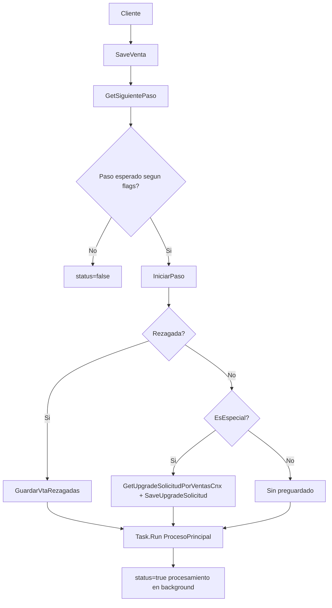

### Método: SaveVtaPersonal

- Endpoint: `POST /api/ProcesoComisiones/save/vta/personal`
- Descripción: persiste las comisiones directas del ciclo y deja preparada la base de residual mensual.
- Parámetros:
  - Body `RequestSaveVtaPersonal`
- Validaciones principales:
  - El paso actual debe ser `COMISION_DIRECTA`.
  - La cantidad recalculada en DB debe coincidir con la cantidad recibida.
  - Si las habilitaciones fallan, cancela el paso.
  - Recalcula manualmente contratos `UPGRADE`, `RECOMPRA` y `RECUPERACION`.
- Servicio o repositorio que invoca:
  - `GetSiguientePaso`, `IniciarPaso`, `CancelarPaso`, `FinalizarPaso`
  - `IProcesoComisionesRepository.GetCalculoVentaPersonal`
  - `IAdministracionHabilitacionComisionRepository.GetHabilitaciones`
  - `ICasosEspecialesRepository.GetUpgradeSolicitudGrd`
  - `IAdministracionVentaPersonalRepository.InsertVentaPersonal`
- Métodos internos llamados:
  - `CalculoVentaResidual`
  - `GetTotalVentaResidual`
- Tablas o vistas consultadas:
  - `administracioncontrato`
  - `pc_configvtapersonal`, `pc_configvtapersonalcomplejo`, `pc_configvtapersonalinicial`
  - `administracionventapersonal`
  - `administracionhabilitacioncomision`
  - `upgrade_solicitud`
  - `t_productos_pagar_mensuales`
- Respuesta final esperada:
  - Confirmación simple si guarda comisiones y residual asociado.

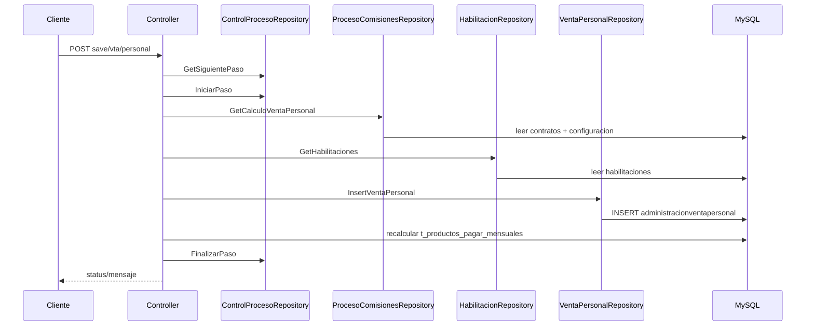

### Método: SaveVtaGrupo

- Endpoint: `POST /api/ProcesoComisiones/save/vta/grupo`
- Descripción: persiste las comisiones de grupo calculadas sobre `red_comprimida`.
- Parámetros:
  - Body `RequestGuardarVentaGrupo`
- Validaciones principales:
  - El paso actual debe ser `COMISION_GRUPO`.
  - El total recalculado debe coincidir con el total recibido.
  - Excluye asesores bloqueados por habilitaciones.
- Servicio o repositorio que invoca:
  - `GetSiguientePaso`, `IniciarPaso`, `CancelarPaso`, `FinalizarPaso`
  - `IProcesoComisionesRepository.GetCalculoVentaGrupo`
  - `IAdministracionHabilitacionComisionRepository.GetHabilitaciones`
  - `IAdministracionSemanaCicloRepository.GetSemanaCicloId`
  - `IAdministracionVentaGrupoRepository.InsertAdministracionVentaGrupo`
- Métodos internos llamados:
  - Ninguno
- Tablas o vistas consultadas:
  - `red_comprimida`
  - `administracioncontrato`
  - `administraciontipocontacto`
  - `administracionventagrupo`
  - `administracionsemanaciclo`
- Respuesta final esperada:
  - Confirmación simple.

## Controller: CuotasVentaResidualController
Patrón: cálculo y persistencia de comisiones residuales mensuales por cuotas pagadas.

| Método | Endpoint | Parámetros | Validaciones / internos | Invoca | Tablas / vistas | Respuesta esperada |
| --- | --- | --- | --- | --- | --- | --- |
| `GetDatos` | `GET /api/CuotasVentaResidual/cuotas/venta/residual` | Headers `Usuario`, `LCicloId`, `Inicio`, `Fin` | Calcula comisiones por cuota con helper `GetComision`; combina ventas, productos pendientes, venta personal e habilitaciones | `GetCuotasVentasResidual`, `GetProductosPagarMensuales`, `GetVentaPersonal`, `GetHabilitaciones`, `GetSiguientePaso` | SQL Server dinámico de cuotas CNX, `t_productos_pagar_mensuales`, `administracionventapersonal`, `administracionhabilitacioncomision` | `ListadoComisionCuotaResidual`, habilitados, XLS y control de paso |
| `Guardar` | `POST /api/CuotasVentaResidual/cuotas/venta/residual` | Headers `Usuario`, `LCicloId`, `Inicio`, `Fin` | Valida paso `COMISION_VENTA_RESIDUAL`; guarda snapshot de cuotas, recalcula detalle, actualiza control de productos y registra paso | `GetSiguientePaso`, `IniciarPaso`, `GetCuotasVentasResidual`, `GetProductosPagarMensuales`, `GetVentaPersonal`, `GetHabilitaciones`, `SaveCuotasVentasProductosPagarMensual`, `SaveControlProductos`, `FinalizarPaso`, `CancelarPaso` | `t_cuotas_ventas_productos_pagar_mensual`, `t_productos_pagar_mensuales`, `t_productos_detalle_cuotas`, `administracionventapersonal`, `administracionhabilitacioncomision`, SQL Server CNX | Confirmación y resumen de actualizaciones |

### Método: Guardar

- Endpoint: `POST /api/CuotasVentaResidual/cuotas/venta/residual`
- Descripción: materializa la comisión residual del mes, deja evidencia de cuotas procesadas y crea nuevas comisiones en `administracionventapersonal` cuando corresponde.
- Parámetros:
  - Headers `Usuario`, `LCicloId`, `Inicio`, `Fin`
- Validaciones principales:
  - El siguiente paso debe ser `COMISION_VENTA_RESIDUAL`.
  - Si falla la consulta de cuotas, productos o habilitaciones, se cancela el paso.
  - El helper `GetComision` respeta topes de cuotas y cuotas ya contabilizadas.
- Servicio o repositorio que invoca:
  - `IControlProcesoRepository.GetSiguientePaso`, `IniciarPaso`, `FinalizarPaso`, `CancelarPaso`
  - `ICuotasVentaResidualRepository.GetCuotasVentasResidual`
  - `ICuotasVentaResidualRepository.GetProductosPagarMensuales`
  - `ICuotasVentaResidualRepository.SaveCuotasVentasProductosPagarMensual`
  - `ICuotasVentaResidualRepository.SaveControlProductos`
  - `IAdministracionVentaPersonalRepository.GetVentaPersonal`
  - `IAdministracionHabilitacionComisionRepository.GetHabilitaciones`
- Métodos internos llamados:
  - `GetComision`
- Tablas o vistas consultadas:
  - `t_cuotas_ventas_productos_pagar_mensual`
  - `t_productos_pagar_mensuales`
  - `t_productos_detalle_cuotas`
  - `administracionventapersonal`
  - `administracionhabilitacioncomision`
  - Query CNX de cuotas vía `ScriptCnx.GetQueryVentaResidual`
- Respuesta final esperada:
  - Éxito: `status=true`, mensaje `Proceso ejecutado correctamente.` y detalle agrupado por producto.

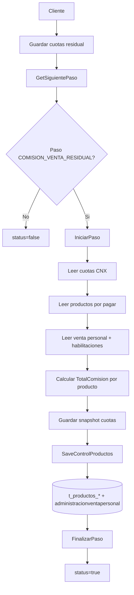

## Controller: RedesController
Patrón: generación de red comprimida y red completa temporal para bonos de grupo/residual.

| Método | Endpoint | Parámetros | Validaciones / internos | Invoca | Tablas / vistas | Respuesta esperada |
| --- | --- | --- | --- | --- | --- | --- |
| `GetDatos` | `GET /api/Redes/armar/red/comprimida/mes` | Headers `Usuario`, `LCicloId`, `Inicio`, `Fin` | Valida paso `RED_COMPRIMIDA`; mezcla vendedores activos con habilitados y sube hasta 7 patrocinadores activos | `GetSiguientePaso`, `IniciarPaso`, `GetHabilitaciones`, `GetObetenerContactoVentasMes`, `GetRedCotactoAll`, `GuardarRedComprimida`, `FinalizarPaso`, `CancelarPaso` | `administracioncontrato`, `administracioncontacto`, `administracionhabilitacioncomision`, `red_comprimida`, `tmp_residual_contacto` | Red comprimida generada y resumen |
| `GetClientesCuotas` | `GET /api/Redes/armar/red/cuotas` | Headers `Usuario`, `LCicloId` | Valida paso `RED_COMPLETA`; arma jerarquía de 7 niveles para todos los contactos y la deja en tabla temporal | `GetSiguientePaso`, `IniciarPaso`, `GetRedCotactoAll`, `GuardarRedContactoTemporal`, `FinalizarPaso`, `CancelarPaso` | `administracioncontacto`, `tmp_residual_contacto`, `tmp_residual_red` | Cantidad de clientes procesados |

### Método: GetDatos

- Endpoint: `GET /api/Redes/armar/red/comprimida/mes`
- Descripción: genera la red comprimida del ciclo tomando vendedores con ventas del mes y asesores habilitados.
- Parámetros:
  - Headers `Usuario`, `LCicloId`, `Inicio`, `Fin`
- Validaciones principales:
  - El siguiente paso debe ser `RED_COMPRIMIDA`.
  - Si la lectura de habilitaciones falla, se cancela el paso.
  - Solo se persiste patrocinio cuando el patrocinador también está activo/habilitado.
- Servicio o repositorio que invoca:
  - `GetSiguientePaso`, `IniciarPaso`, `FinalizarPaso`, `CancelarPaso`
  - `IRedesRepository.GetObetenerContactoVentasMes`
  - `IRedesRepository.GetRedCotactoAll`
  - `IRedesRepository.GuardarRedComprimida`
  - `IAdministracionHabilitacionComisionRepository.GetHabilitaciones`
- Métodos internos llamados:
  - Ninguno; el while de ascenso hasta 7 niveles vive en el controller.
- Tablas o vistas consultadas:
  - `administracioncontrato`
  - `administracioncontacto`
  - `administracionhabilitacioncomision`
  - `red_comprimida`
  - `tmp_residual_contacto`
- Respuesta final esperada:
  - Fechas de inicio/fin, listado de activos y red comprimida creada.

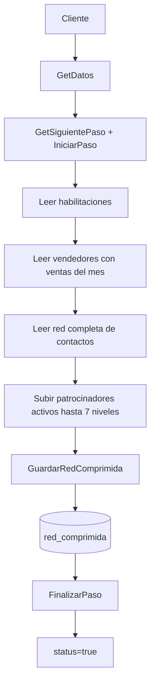

### Método: GetClientesCuotas

- Endpoint: `GET /api/Redes/armar/red/cuotas`
- Descripción: crea una tabla temporal con la red completa de 7 niveles para todos los hijos.
- Parámetros:
  - Headers `Usuario`, `LCicloId`
- Validaciones principales:
  - El siguiente paso debe ser `RED_COMPLETA`.
- Servicio o repositorio que invoca:
  - `GetSiguientePaso`, `IniciarPaso`, `FinalizarPaso`, `CancelarPaso`
  - `IRedesRepository.GetRedCotactoAll`
  - `IRedesRepository.GuardarRedContactoTemporal`
- Métodos internos llamados:
  - Ninguno; la construcción de `PadreN1..PadreN7` se hace en el controller.
- Tablas o vistas consultadas:
  - `administracioncontacto`
  - `tmp_residual_contacto`
  - `tmp_residual_red`
- Respuesta final esperada:
  - Cantidad de clientes para cuotas y timestamps del proceso.

## Controller: BonoResidualController
Patrón: ingestión de cartera/cuotas, cálculo de excedente, residual y bono par.

| Método | Endpoint | Parámetros | Validaciones / internos | Invoca | Tablas / vistas | Respuesta esperada |
| --- | --- | --- | --- | --- | --- | --- |
| `GetCartera` | `GET /api/BonoResidual/get/cartera` | Headers `Usuario`, `LCicloId` | Sin validaciones extra; agrega resumen por estado | `GetCarteraAll`, `GetSiguientePaso` | `BDComisiones.DBO.T_CARTERA` | Resumen, XLS y control de paso |
| `GuardarCartera` | `POST /api/BonoResidual/save/cartera` | Headers `Usuario`, `LCicloId` | Valida paso `OBTENER_CARTERA`; obtiene cartera completa y la copia a staging local | `GetSiguientePaso`, `IniciarPaso`, `GetCarteraAll`, helper `GuardarCarteraGrl`, `GuardarCartera`, `FinalizarPaso`, `CancelarPaso` | `BDComisiones.DBO.T_CARTERA`, `Cartera`, `conf_*` | Confirmación y timestamps |
| `GetCuota` | `GET /api/BonoResidual/get/cuota` | Headers `Usuario`, `Inicio`, `Fin`, `LCicloId` | Sin validaciones extra; agrupa por tipo de pago | `GetCuota`, `GetSiguientePaso` | Query CNX de cuotas, staging `T_ACCIONESCUOTASGRL` como destino posterior | Resumen, XLS y control de paso |
| `GuardarCuota` | `POST /api/BonoResidual/save/cuota` | Headers `Usuario`, `Inicio`, `Fin`, `LCicloId` | Inicia paso `OBTENER_CUOTAS`, obtiene cuotas y las vuelca a staging | `GetSiguientePaso`, `IniciarPaso`, `GetCuota`, helper `GuardarCuotaGrl`, `GuardarCuota`, `FinalizarPaso`, `CancelarPaso` | Query CNX de cuotas, `T_ACCIONESCUOTASGRL` | Confirmación y timestamps |
| `GetExcedente` | `GET /api/BonoResidual/get/excedente` | Headers `Usuario`, `Inicio`, `Fin`, `LCicloId` | Filtra ventas cuya `SCuotaInicialOriginal - ValorCi > 0.05` y excluye `UPGRADE` | `GetVentaCnx`, `GetSiguientePaso` | Query CNX ventas, `conf_*` | Lista de excedentes y control de paso |
| `GuardarExcedente` | `POST /api/BonoResidual/save/excedente` | Headers `Usuario`, `Inicio`, `Fin`, `LCicloId` | Valida paso `OBTENER_EXCEDENTE`; transforma ventas excedentes a registros `TCuota` y los inserta como cuotas | `GetSiguientePaso`, `IniciarPaso`, `GetVentaCnx`, `GuardarCuota(..., excedente=true)`, `FinalizarPaso`, `CancelarPaso` | Query CNX ventas, `T_ACCIONESCUOTASGRL` | Confirmación |
| `GetBonoResidual` | `GET /api/BonoResidual/get/calculo/residual` | Headers `Usuario`, `LCicloId` | Excluye bloqueados; requiere configuración `BR` por ciclo; solo deja activos/habilitados | `GetDataCalculoBonoResidual`, `GetHabilitaciones`, `GetConfiguracion`, `GetSiguientePaso` | `T_ACCIONESCUOTASGRL`, `tmp_residual_red`/red residual, `administracioncontacto`, `br_configuracion*`, `administracionhabilitacioncomision` | Resumen por empresa/proyecto, contador, XLS y control de paso |
| `GuardarBonoResidual` | `POST /api/BonoResidual/save/calculo/residual` | Headers `Usuario`, `LCicloId` | Valida paso `COMISION_RESIDUAL`; recalcula residual, resume por contacto/complejo y persiste tres estructuras | `GetSiguientePaso`, `IniciarPaso`, `GetDataCalculoBonoResidual`, `GetHabilitaciones`, `GetConfiguracion`, `SaveAdministracionBonoResidual`, `SaveAdministracionBonoCompleto`, `SaveAdministracionRedEmpresaComplejo`, `FinalizarPaso`, `CancelarPaso` | `administracionbonoresidual`, `t_bonocompleto`, `administracionredempresacomplejo`, más tablas fuente del cálculo | Confirmación con métricas |
| `ObtenerBonoPar` | `GET /api/BonoResidual/get/bono/par` | Headers `Usuario`, `LCicloId`, `Inicio`, `Fin` | Excluye bloqueados; solo mantiene ganadores con contrato normal o habilitación activa | `GetSiguientePaso`, `GetBonoPar`, `GetHabilitaciones`, `GetAdministracionContratoFechaVentaResidual` | `bonopar` lógico calculado desde query `ScriptGrd`, `administracioncontrato`, `administracionhabilitacioncomision` | Lista, XLS y control de paso |
| `GuardarBonoPar` | `POST /api/BonoResidual/save/bono/par` | Headers `Usuario`, `LCicloId`, `Inicio`, `Fin` | El paso puede ser uno de los definidos por `EsBonoPar`; filtra ganadores no elegibles y guarda cabecera/detalle | `GetSiguientePaso`, `IniciarPaso`, `GetBonoPar`, `GetHabilitaciones`, `GetAdministracionContratoFechaVentaResidual`, `SaveBonoPar`, `FinalizarPaso`, `CancelarPaso` | `bonopar`, `bonopardetalle`, `administracioncontrato`, `administracionhabilitacioncomision` | Confirmación |

### Método: GuardarBonoResidual

- Endpoint: `POST /api/BonoResidual/save/calculo/residual`
- Descripción: calcula el bono residual por nivel y lo persiste agregado por contacto y por contacto-complejo.
- Parámetros:
  - Headers `Usuario`, `LCicloId`
- Validaciones principales:
  - El siguiente paso debe ser `COMISION_RESIDUAL`.
  - Las fuentes de residual, habilitaciones y configuración BR deben responder correctamente.
  - Se excluyen asesores bloqueados y solo se consideran activos/habilitados.
  - Si no hay registros habilitados, el paso se finaliza sin persistir pagos.
- Servicio o repositorio que invoca:
  - `GetSiguientePaso`, `IniciarPaso`, `FinalizarPaso`, `CancelarPaso`
  - `IBonoResidualRepository.GetDataCalculoBonoResidual`
  - `IAdministracionHabilitacionComisionRepository.GetHabilitaciones`
  - `IBrConfiguracionRepository.GetConfiguracion`
  - `IAdministracionBonoResidualRepository.SaveAdministracionBonoResidual`
  - `IAdministracionBonoResidualRepository.SaveAdministracionBonoCompleto`
  - `IAdministracionBonoResidualRepository.SaveAdministracionRedEmpresaComplejo`
- Métodos internos llamados:
  - Ninguno; el armado de `BrCalculoItem`, `ItemBonoCompleto` y `ItemRedEmpresaComplejo` se hace en el controller.
- Tablas o vistas consultadas:
  - Fuentes: `T_ACCIONESCUOTASGRL`, `tmp_residual_red` o estructura equivalente del cálculo, `administracioncontacto`, `administracionhabilitacioncomision`, `br_configuracion`, `br_configuraciondetalle`
  - Destino: `administracionbonoresidual`, `t_bonocompleto`, `administracionredempresacomplejo`
- Respuesta final esperada:
  - Conteos de fuentes y número de residuales persistidos.

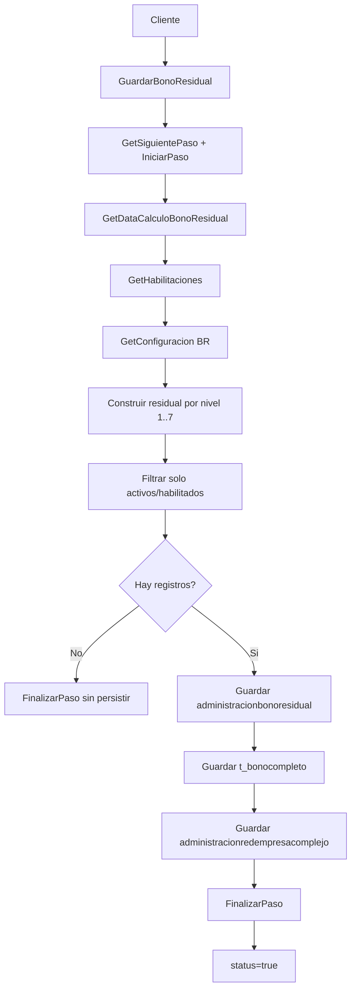

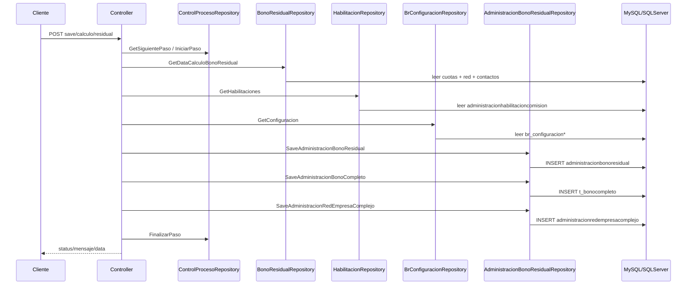

### Método: GuardarBonoPar

- Endpoint: `POST /api/BonoResidual/save/bono/par`
- Descripción: persiste el bono par para los ganadores elegibles del periodo.
- Parámetros:
  - Headers `Usuario`, `LCicloId`, `Inicio`, `Fin`
- Validaciones principales:
  - El paso actual debe pertenecer al conjunto reconocido por `PasosDiccionario.EsBonoPar`.
  - Se excluyen ganadores bloqueados.
  - Solo se conservan ganadores con contrato normal en el rango o con habilitación activa.
  - Si no hay ganadores elegibles, el paso se marca como finalizado sin inserts.
- Servicio o repositorio que invoca:
  - `GetSiguientePaso`, `IniciarPaso`, `FinalizarPaso`, `CancelarPaso`
  - `IBonoParRepository.GetBonoPar`
  - `IAdministracionHabilitacionComisionRepository.GetHabilitaciones`
  - `IAdministracionContratoRepository.GetAdministracionContratoFechaVentaResidual`
  - `IBonoParRepository.SaveBonoPar`
- Métodos internos llamados:
  - Ninguno
- Tablas o vistas consultadas:
  - Fuente: query `ScriptGrd.QueryBonoPar` y detalle `ScriptGrd.QueryDetalleBonoPar`, además `administracioncontrato`, `administracionhabilitacioncomision`
  - Destino: `bonopar`, `bonopardetalle`
- Respuesta final esperada:
  - Confirmación simple o mensaje de que no hubo ganadores habilitados.

## Controller: ReportesController
Patrón: generación de PDF y, en varios casos, XLS a partir de consultas agregadas.

| Método | Endpoint | Parámetros | Validaciones / internos | Invoca | Tablas / vistas | Respuesta esperada |
| --- | --- | --- | --- | --- | --- | --- |
| `ReporteComisiones` | `GET /api/Reportes/comisiones` | Headers `lCicloId`, `lContactoId`, `usuario?` | Combina reporte base + resumen de comisiones; calcula bandera `tieneComicion` | `GetReporteComision`, `GetComision`, `ReporteComisionesDocumento.GeneratePdf` | `administracionventapersonal`, `administracionventagrupo`, `administracionbonoresidual`, `bonopar`, `administraciondescuentociclo`, `tbl_retencionempresa`, `administracioncontacto`, `administracionciclo` | PDF base64 y `tieneComicion` |
| `ReporteAplicaciones` | `GET /api/Reportes/aplicaciones` | Headers `lCicloId`, `lContactoId`, `usuario?` | Si no hay aplicaciones devuelve `status=false` con archivos vacíos | `GetReporteAplicacines`, `ReporteAplicacionesDocumento.GeneratePdf` | Query de aplicaciones en `ReportesRepository` | PDF base64 |
| `ReporteDescuentoEmpresa` | `GET /api/Reportes/descuento/empresa` | Headers `lCicloId`, `empresaId`, `usuario?` | Si no hay datos devuelve archivos vacíos | `GetReporteDecuentoEmpresa`, `ReporteDescuentoEmpresa.GeneratePdf`, `DescuentoEmpresaXls.GetDescuentoEmpresaXls` | `administraciondescuentociclo*`, `administracionempresa`, `empresa_complejo` y fuentes del repo | PDF y XLS base64 |
| `ReporteFacturacion` | `GET /api/Reportes/facturacion` | Headers `lCicloId`, `lContactoId`, `usuario?` | Si no hay datos devuelve archivos vacíos; añade detalle de factura y logo | `GetReporteFacturacion`, `GetDetalleFacturaPagination`, `ReporteFacturacion.GeneratePdf` | `administraciondetallefactura`, `administraciontipocomision` y fuentes de facturación del repo | PDF base64 |
| `ReporteProrrateo` | `GET /api/Reportes/prorrateo` | Header `lCicloId`, `usuario?` | Si no hay datos devuelve archivos vacíos | `GetReporteProrrateo`, `ReporteProrrateo.GeneratePdf`, `ProrrateoXls.GetProrrateoXls` | Fuentes de prorrateo del repo | PDF y XLS base64 |
| `ReporteComisionServicio` | `GET /api/Reportes/comision/servicio` | Headers `lCicloId`, `empresaId`, `usuario?` | Si no hay datos devuelve archivos vacíos | `GetReporteComisionServicio`, `ReporteComisionServicio.GeneratePdf`, `ComisionServicioXls.GetComisionServicioXls` | Fuentes de servicio/comisión del repo | PDF y XLS base64 |
| `ReportePagarComision` | `GET /api/Reportes/pagar/comision` | Headers `lCicloId`, `usuario?` | Si no hay datos devuelve archivos vacíos; mezcla reporte pago + prorrateo | `GetReportePagarComision`, `GetReporteProrrateo`, `ReportePagarComision.GeneratePdf`, `PagarComisionxls.GetPagarComisionXls` | Fuentes de pago/prorrateo del repo | PDF y XLS base64 |
| `ReportePlanCarrera` | `GET /api/Reportes/plan/carrera` | Headers `lCicloId`, `usuario?` | Si no hay datos devuelve archivos vacíos | `GetReportePlanCarrera`, `ReportePlanCarrera.GeneratePdf`, `PlanCarreraXls.GetPlanCarreraXls` | `reportesmontesion`, `administracioncontacto`, `administracionnivel`, `basepais`, `administracionciclo` | PDF y XLS base64 |
| `ReporteAscensoRango` | `GET /api/Reportes/ascenso/rango` | Headers `lCicloId`, `usuario?` | Si no hay datos devuelve archivos vacíos | `GetReporteAscensoRango`, `ReporteAscensoRango.GeneratePdf`, `AscensoRangoXls.GetAscensoRangoXls` | `reportesmontesion`, `nuevospremiosmontesion`, `administracioncontacto`, `administracionciclo`, `basepais`, `administracionnivel` | PDF y XLS base64 |

### Método: ReporteComisiones

- Endpoint: `GET /api/Reportes/comisiones`
- Descripción: arma el reporte PDF consolidado de comisiones de un asesor para un ciclo.
- Parámetros:
  - Headers `lCicloId`, `lContactoId`, `usuario?`
- Validaciones principales:
  - No hay validación previa fuerte; si falla alguna consulta entra al `catch`.
  - Marca `tieneComicion` cuando existe comisión total o detalle en cualquiera de los bloques del reporte.
- Servicio o repositorio que invoca:
  - `IReportesRepository.GetReporteComision`
  - `IAdministracionDescuentoComisionRepository.GetComision`
  - `ReporteComisionesDocumento.GeneratePdf`
- Métodos internos llamados:
  - Ninguno
- Tablas o vistas consultadas:
  - `administracionventapersonal`
  - `administracionventagrupo`
  - `administracionbonoresidual`
  - `bonopar`
  - `administraciondescuentociclo`
  - `tbl_retencionempresa`
  - `administracioncontacto`
  - `administracionciclo`
- Respuesta final esperada:
  - `FileName`, `FileBase64`, `ContentType`, `tieneComicion`.

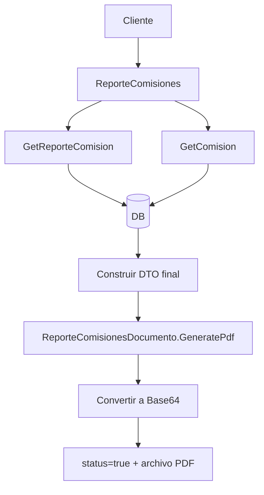

### Método: ReportePagarComision

- Endpoint: `GET /api/Reportes/pagar/comision`
- Descripción: genera el reporte final de pago de comisiones juntando el agregado principal y el prorrateo por empresa.
- Parámetros:
  - Headers `lCicloId`, `usuario?`
- Validaciones principales:
  - Si no hay filas en `GetReportePagarComision`, devuelve archivos vacíos.
- Servicio o repositorio que invoca:
  - `IReportesRepository.GetReportePagarComision`
  - `IReportesRepository.GetReporteProrrateo`
  - `ReportePagarComision.GeneratePdf`
  - `PagarComisionxls.GetPagarComisionXls`
- Métodos internos llamados:
  - Agrupación local para `headerEmpresa`.
- Tablas o vistas consultadas:
  - Fuentes del query `QUERY_PAGAR_COMISION`
  - Fuentes del query `QUERY_PRORRATEO`
- Respuesta final esperada:
  - `FileName`, `FileNameXls`, `FileBase64`, `ContentType`, `base64Xls`.

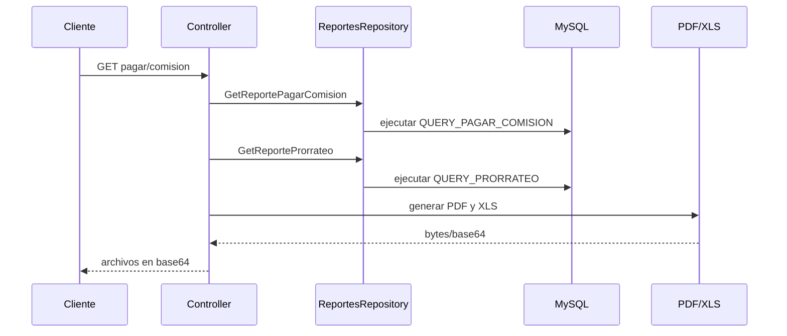

## Notas de interpretación

- `VentaCnxRepository`, `CuotasVentaResidualRepository` y parte de `BonoResidualRepository` leen SQL dinámico desde `Query.Cnx.ScriptCnx`; por eso algunas tablas de SQL Server dependen del ambiente configurado.
- `BonoParRepository` usa `Query.Grd.ScriptGrd` para construir el cálculo del bono par; la mejor interpretación es que agrega ventas y detalle desde `administracioncontrato`, `administracioncontacto`, `red_comprimida` y luego persiste en `bonopar` y `bonopardetalle`.
- `ReportesRepository` concentra SQL muy extenso. En este README se listan las tablas dominantes; puede haber más joins auxiliares por empresa, país, complejos o tablas temporales.
- No existe una capa `Service` formal para la mayoría de endpoints. Cuando en los diagramas aparece `Repository`, ese es el punto real donde vive la lógica de acceso a datos.
